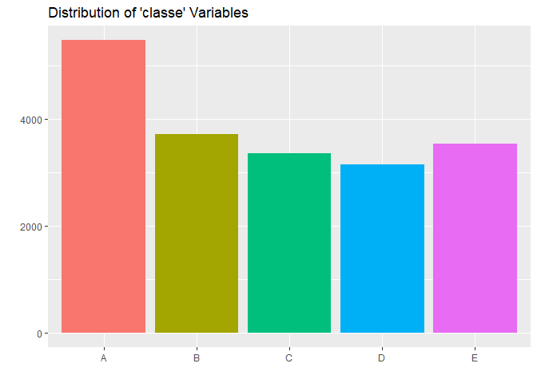
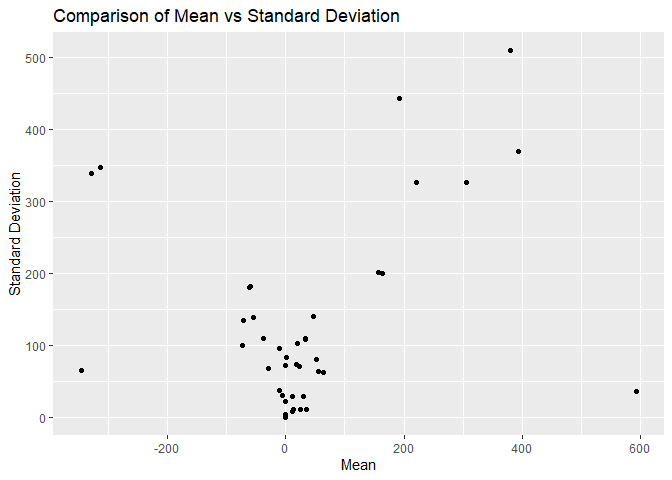
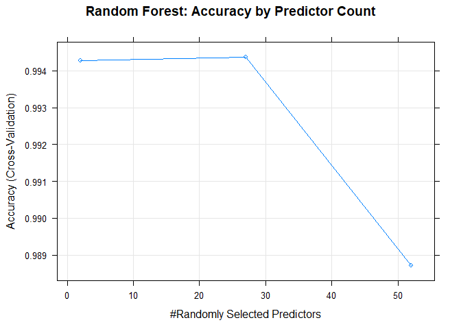

```
## 
## Attaching package: 'dplyr'
```

```
## The following objects are masked from 'package:stats':
## 
##     filter, lag
```

```
## The following objects are masked from 'package:base':
## 
##     intersect, setdiff, setequal, union
```

```
## Loading required package: lattice
```

```
## Loading required package: foreach
```

```
## Loading required package: iterators
```

```
## Loading required package: Formula
```

```
## Loading required package: plotmo
```

```
## Loading required package: plotrix
```

```
## Loading required package: TeachingDemos
```


## Prediction objective

* A research group tested whether they could measure the quality of exercise by classifying the weight lifting technique errors using physical sensors.  
  
* The goal is to predict the *classe* variable.  The *classe* variable represents the type of error with "A" representing a correct dumbell curl and "B","C","D" and "E" representing typical errors in technique.  
  
* Any other variables can be used to predict *classe*.  
  
## Inputs  

* The data has already been partitioned in a training and testing sets.  

* No codebook has been provided but the research paper was available.  It summarizes
the methodology of the study and the context of the data.  
  


```r
dim(training)
```

```
## [1] 19622   160
```

```r
head(select(training,1:15))
```

```
##   X user_name raw_timestamp_part_1 raw_timestamp_part_2   cvtd_timestamp
## 1 1  carlitos           1323084231               788290 05/12/2011 11:23
## 2 2  carlitos           1323084231               808298 05/12/2011 11:23
## 3 3  carlitos           1323084231               820366 05/12/2011 11:23
## 4 4  carlitos           1323084232               120339 05/12/2011 11:23
## 5 5  carlitos           1323084232               196328 05/12/2011 11:23
## 6 6  carlitos           1323084232               304277 05/12/2011 11:23
##   new_window num_window roll_belt pitch_belt yaw_belt total_accel_belt
## 1         no         11      1.41       8.07    -94.4                3
## 2         no         11      1.41       8.07    -94.4                3
## 3         no         11      1.42       8.07    -94.4                3
## 4         no         12      1.48       8.05    -94.4                3
## 5         no         12      1.48       8.07    -94.4                3
## 6         no         12      1.45       8.06    -94.4                3
##   kurtosis_roll_belt kurtosis_picth_belt kurtosis_yaw_belt
## 1               <NA>                <NA>              <NA>
## 2               <NA>                <NA>              <NA>
## 3               <NA>                <NA>              <NA>
## 4               <NA>                <NA>              <NA>
## 5               <NA>                <NA>              <NA>
## 6               <NA>                <NA>              <NA>
##   skewness_roll_belt
## 1               <NA>
## 2               <NA>
## 3               <NA>
## 4               <NA>
## 5               <NA>
## 6               <NA>
```

```r
dim(testing)
```

```
## [1]  20 160
```

```r
head(select(testing,1:15))
```

```
##   X user_name raw_timestamp_part_1 raw_timestamp_part_2   cvtd_timestamp
## 1 1     pedro           1323095002               868349 05/12/2011 14:23
## 2 2    jeremy           1322673067               778725 30/11/2011 17:11
## 3 3    jeremy           1322673075               342967 30/11/2011 17:11
## 4 4    adelmo           1322832789               560311 02/12/2011 13:33
## 5 5    eurico           1322489635               814776 28/11/2011 14:13
## 6 6    jeremy           1322673149               510661 30/11/2011 17:12
##   new_window num_window roll_belt pitch_belt yaw_belt total_accel_belt
## 1         no         74    123.00      27.00    -4.75               20
## 2         no        431      1.02       4.87   -88.90                4
## 3         no        439      0.87       1.82   -88.50                5
## 4         no        194    125.00     -41.60   162.00               17
## 5         no        235      1.35       3.33   -88.60                3
## 6         no        504     -5.92       1.59   -87.70                4
##   kurtosis_roll_belt kurtosis_picth_belt kurtosis_yaw_belt
## 1                 NA                  NA                NA
## 2                 NA                  NA                NA
## 3                 NA                  NA                NA
## 4                 NA                  NA                NA
## 5                 NA                  NA                NA
## 6                 NA                  NA                NA
##   skewness_roll_belt
## 1                 NA
## 2                 NA
## 3                 NA
## 4                 NA
## 5                 NA
## 6                 NA
```


## Cleaning Data, Exploratory Analysis


* Some individual variables are ambigious in their meaning including
*num_window* and *new_window* - further investigation is needed.  

* According to the study, subjects did one set of 10 repetitions of each "class" of exercise.  The researchers would record the data using a sliding window ranging from 0.5 secs to 2.5 secs.  The *new_window* variables that are *yes* have the calculated variables like minimum, maximum, etc.  This suggests that the *new_window-yes* values are the end of the sliding windows and the extra values are calculated at this point.  

* The *num_window* values all consistently line up with specific *classe* values.  For instance, all *num_window* 11 values correspond to *classe* "A".  This suggests *num_window* either represents a set of repetitions or individual repetitions. This was determined using the code below. 


```r
#create table of frequency of classe per num_window
#using code below to create table and count number of num_window that
#have only one type of classe e.  All num_window have exclusively one classe
table.classe.training.proc <- table(training.proc.num_window$num_window, training.proc.num_window$classe)
table.classe.training.proc <- data.frame(table.classe.training.proc)
table.classe.training.proc <- table.classe.training.proc[table.classe.training.proc$Freq > 0, ] 
classe.per.num_window <- count(table.classe.training.proc, Var1)

#length of vector is 857, same as all observations
freq.1.classe.num_window <- length(classe.per.num_window[classe.per.num_window$n == 1,]$Var1)
#num_window will be treated as a repetition
```
  
* The testing set has columns that are exclusively NA.  On further examination this is because these columns are the caculated values and are populated when the *new_window* variable equals ye" - none of the testing *new_window* variables equals "yes".  Therefore, these columns were removed from both the training and testing sets since they would not be useful as predictors.  
  
* Some variables shared by both testing and training were excluded as perdictors
as they had no obvious relation to classifying the repetitions (i.e. *raw_timestamp_part_1*).  Removing these predictors improved the performance of the models.  

## Features

* The classified variable *classe* is discrete and not continuous.  Therefore, a simple
count bar graph was used to review the distribution of potential outcomes.  It looks like there
is a reasonable balance of outcomes.

<!-- -->

* The mean and standard deviation were graphed to see if there were any extreme outliers or unusual values.  None were found.  

<!-- -->
  
* The review suggests no need for feature modification and preprocessing.  

## Algorithims

* Parallel processing was enabled to speed processing.  
  
* K-fold cross validation was included using trainControl function.

### Model Choices
  
* Three models were compared:


```r
cluster <- makeCluster(detectCores() - 1) # convention to leave 1 core for OS
registerDoParallel(cluster)

fitControl <- trainControl(method = "cv",
                           number = 5,
                           allowParallel = TRUE)
```
Random Forest

```r
fit.rf.obj <- train(classe~., method="rf", data = training.proc.num_window[c(-1,-2)],
                    trControl = fitControl)
```
Generalized Boosted Regression Modeling

```r
fit.gbm.obj <- train(classe~., method="gbm", data = training.proc.num_window[c(-1,-2)],
                    trControl = fitControl)
```
 Linear Discriminant Analysis

```r
fit.lda.obj <- train(classe~., method="lda", data = training.proc.num_window[c(-1,-2)],
                     trControl = fitControl)

stopCluster(cluster)
registerDoSEQ()
```

## Evaluation

### In Sample Accuracy and Error
* In sample error is as follows for the 3 different models.  

```
##           Model In.Sample.Error  Accuracy     Kappa
## 1 Random Forest    0.0001019264 0.9998981 0.9998711
## 2           GBM    0.0268066456 0.9731934 0.9660845
## 3           LDA    0.2955356233 0.7044644 0.6259796
```
### Cross Validation and Out of Sample Error
* 5 k-folds were chosen since each fold represents 20% of training data.  
  
* Comparing the confusion matrices, Random Forest model looks the most accurate out of sample as well.  
  
* Random Forest  

```
## Cross-Validated (5 fold) Confusion Matrix 
## 
## (entries are percentual average cell counts across resamples)
##  
##           Reference
## Prediction    A    B    C    D    E
##          A 28.4  0.1  0.0  0.0  0.0
##          B  0.0 19.2  0.1  0.0  0.0
##          C  0.0  0.0 17.3  0.1  0.0
##          D  0.0  0.0  0.1 16.2  0.0
##          E  0.0  0.0  0.0  0.0 18.3
##                             
##  Accuracy (average) : 0.9944
```
* Generalized Boosted Regression Modeling   

```
## Cross-Validated (5 fold) Confusion Matrix 
## 
## (entries are percentual average cell counts across resamples)
##  
##           Reference
## Prediction    A    B    C    D    E
##          A 28.0  0.6  0.0  0.0  0.0
##          B  0.3 18.2  0.5  0.1  0.2
##          C  0.1  0.5 16.7  0.5  0.1
##          D  0.1  0.0  0.2 15.7  0.2
##          E  0.0  0.0  0.0  0.1 17.7
##                             
##  Accuracy (average) : 0.9631
```
* Linear Discriminant Analysis   

```
## Cross-Validated (5 fold) Confusion Matrix 
## 
## (entries are percentual average cell counts across resamples)
##  
##           Reference
## Prediction    A    B    C    D    E
##          A 23.3  3.0  1.7  1.0  0.7
##          B  0.6 12.3  1.7  0.7  3.1
##          C  2.3  2.4 11.4  1.9  1.7
##          D  2.2  0.7  2.1 12.1  1.8
##          E  0.1  0.9  0.5  0.7 11.1
##                             
##  Accuracy (average) : 0.7023
```

* Using cross-validation, random forest has the highest out of sample average accuracy and the lowest average out of sample error.  GBM's performance is comparable with random foreest while the LDA model has the worst performance. 

```
##           Model Out.of.Error.Sample Mean.Accuracy Mean.Kappa
## 1 Random Forest          0.00562023     0.9943798  0.9928898
## 2           GBM          0.03694872     0.9630513  0.9532528
## 3           LDA          0.29766981     0.7023302  0.6232714
```
## Results

* As a result of the comparison, the Random Forest model will be used.  It has an Out of Sample error of less than 1% when using cross-validation and performs the best out of the 3 models.  
  
* The *Accuracy by Predictor Count* graph suggests that only a few predictors are need to optimally classify the type of exercise and that once the predictors approach 30 it begins to slightly decrease the accuracy of the model.

<!-- -->

## Appendix

### R Parameters


```r
sessionInfo()
```

```
## R version 3.6.1 (2019-07-05)
## Platform: x86_64-w64-mingw32/x64 (64-bit)
## Running under: Windows 10 x64 (build 18362)
## 
## Matrix products: default
## 
## locale:
## [1] LC_COLLATE=English_United States.1252 
## [2] LC_CTYPE=English_United States.1252   
## [3] LC_MONETARY=English_United States.1252
## [4] LC_NUMERIC=C                          
## [5] LC_TIME=English_United States.1252    
## 
## attached base packages:
## [1] parallel  stats     graphics  grDevices utils     datasets  methods  
## [8] base     
## 
## other attached packages:
##  [1] earth_5.1.1        plotmo_3.5.5       TeachingDemos_2.10
##  [4] plotrix_3.7-6      Formula_1.2-3      doParallel_1.0.15 
##  [7] iterators_1.0.12   foreach_1.4.7      caret_6.0-84      
## [10] lattice_0.20-38    ggplot2_3.2.0      dplyr_0.8.3       
## 
## loaded via a namespace (and not attached):
##  [1] gbm_2.1.5           tidyselect_0.2.5    xfun_0.8           
##  [4] purrr_0.3.2         reshape2_1.4.3      splines_3.6.1      
##  [7] colorspace_1.4-1    generics_0.0.2      htmltools_0.3.6    
## [10] stats4_3.6.1        yaml_2.2.0          survival_2.44-1.1  
## [13] prodlim_2018.04.18  rlang_0.4.0         e1071_1.7-2        
## [16] ModelMetrics_1.2.2  pillar_1.4.2        glue_1.3.1         
## [19] withr_2.1.2         plyr_1.8.4          lava_1.6.6         
## [22] stringr_1.4.0       timeDate_3043.102   munsell_0.5.0      
## [25] gtable_0.3.0        recipes_0.1.6       codetools_0.2-16   
## [28] evaluate_0.14       labeling_0.3        knitr_1.23         
## [31] class_7.3-15        Rcpp_1.0.1          scales_1.0.0       
## [34] ipred_0.9-9         gridExtra_2.3       digest_0.6.20      
## [37] stringi_1.4.3       grid_3.6.1          tools_3.6.1        
## [40] magrittr_1.5        lazyeval_0.2.2      tibble_2.1.3       
## [43] randomForest_4.6-14 crayon_1.3.4        pkgconfig_2.0.2    
## [46] MASS_7.3-51.4       Matrix_1.2-17       data.table_1.12.2  
## [49] lubridate_1.7.4     gower_0.2.1         assertthat_0.2.1   
## [52] rmarkdown_1.14      R6_2.4.0            rpart_4.1-15       
## [55] nnet_7.3-12         nlme_3.1-140        compiler_3.6.1
```


```r
library(dplyr)
library(ggplot2)
library(caret)
library(parallel)
library(doParallel)
library(earth)
```
